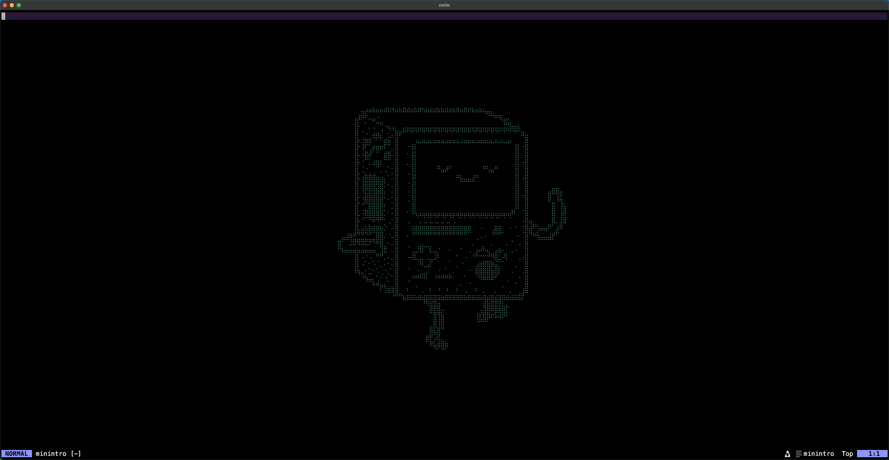

# Macterm

Macterm is a my current config for MacBook. This config contains kitty and nvim configurations.

## Installation

Install and copy kitty and nvim folders to '~/.config/'.

> [!Important]
> This repo contains configs only, if you want use it, you should install kitty and nvim yourself.

> [!Tip]
> Kitty config keeps some colorschemes which you can switch at the end of the file 'kitty/kitty.conf'.
> And change colorschemes itself with files '*-theme.conf' in 'kitty' folder.

> [!Tip]
> Nvim config have presets configs at 'nvim/lua/plugins/colorsheme.lua' file. And statusline presets for
> this colorschemes at 'nvim/lua/plugins/statusline.lua' file.

## Screenshots

# Kitty screnshot with default colorscheme

# Nvim screenshot with kitty default colorscheme

> [!Tip]
> Nvim background color change with kitty background color.
